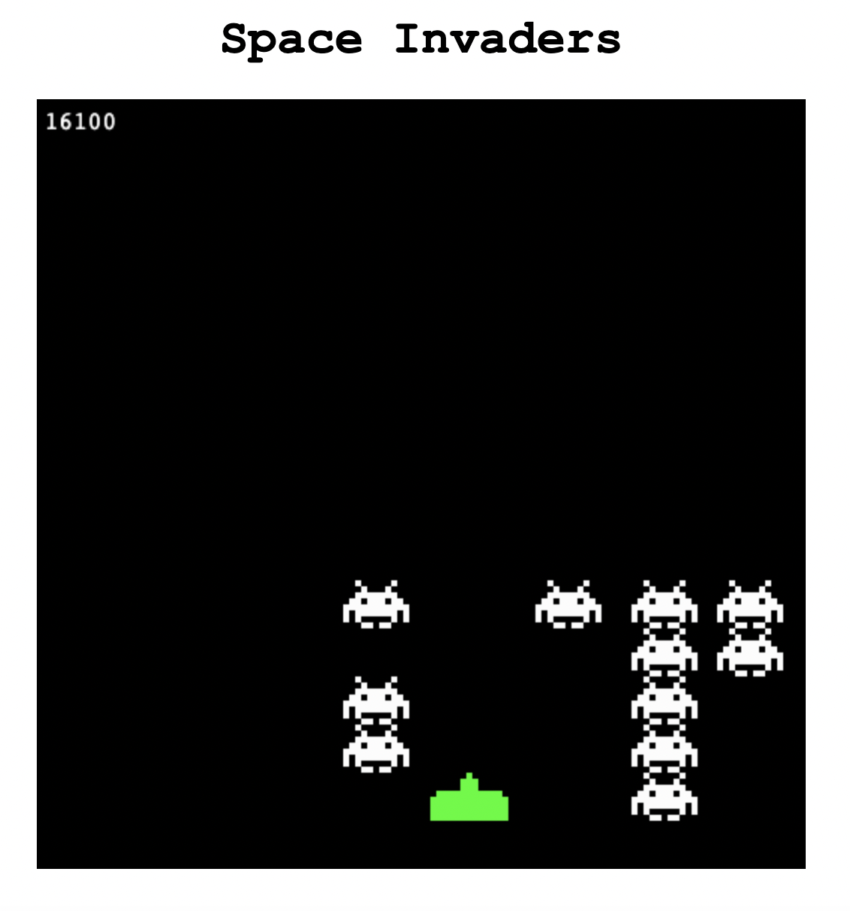
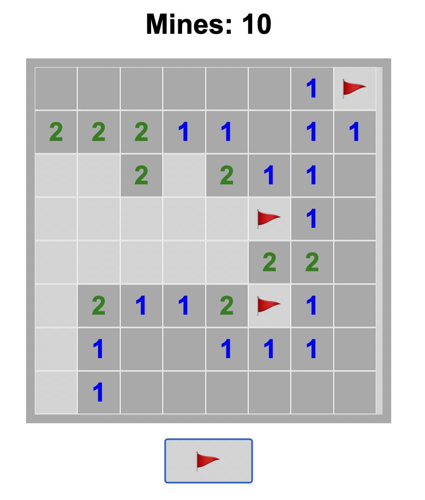
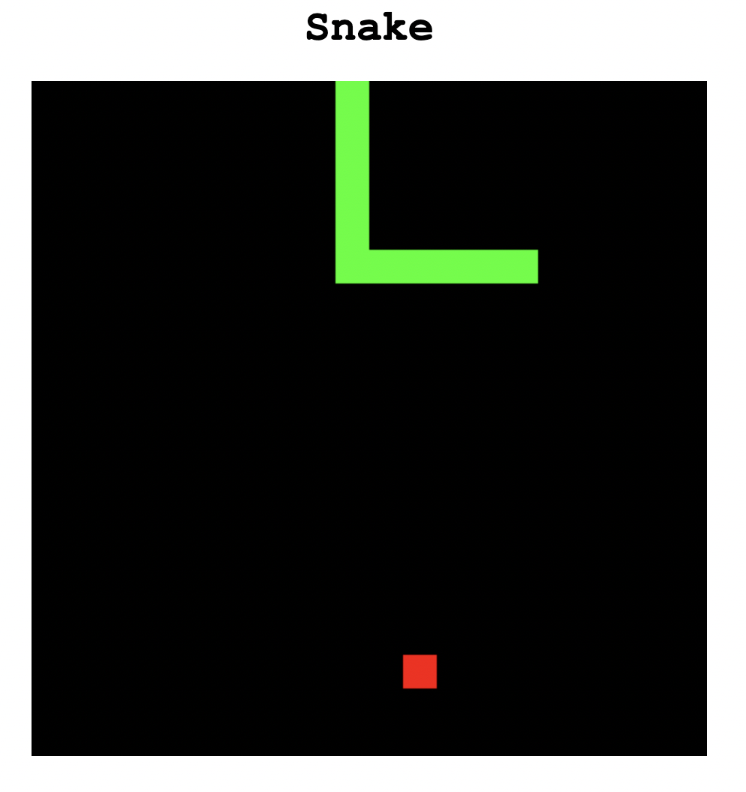

<!-- Header Start -->

<!-- Header End -->

<!-- Testimonial Start -->

    

        

            <h1 class="display-1 text-uppercase text-white" style="-webkit-text-stroke: 1px #dee2e6;">Games & More</h1>
            <h1 class="position-absolute text-uppercase text-primary">Let's Play!</h1>
        

        

            

                

                    

                        <i class="fa fa-3x fa-quote-left text-primary mb-4"></i>
                        <h4 class="font-weight-light mb-4">
                            🛰The objective of the game is to control a small spaceship at the bottom of the screen and shoot down rows of 
                            invading aliens that move side to side and gradually move closer to the player's spaceship.🚀
                        </h4>
                        
                        <a class="font-weight-bold m-0" href="https://woodylinwc.github.io/Space-Invaders" target="_blank"><h5 class="font-weight-bold m-0">-> Space Invader <-</h5></a>
                        arcade-style shoot 'em up game
                    

                    

                        <i class="fa fa-3x fa-quote-left text-primary mb-4"></i>
                        <h4 class="font-weight-light mb-4">
                            🔎The objective of the game is to clear a board containing hidden mines without detonating any of them.💣
                        </h4>
                        
                        <a class="font-weight-bold m-0" href="https://woodylinwc.github.io/Minesweeper/" target="_blank"><h5 class="font-weight-bold m-0">-> Minesweeper <-</h5></a>
                        classic puzzle game
                    

                    

                        <i class="fa fa-3x fa-quote-left text-primary mb-4"></i>
                        <h4 class="font-weight-light mb-4">
                            🐍The objective of the game is to achieve the highest score possible by eating as much food as possible without crashing into obstacles or the snake's own tail.🍎
                        </h4>
                        
                        <a class="font-weight-bold m-0" href="https://woodylinwc.github.io/Snake" target="_blank"><h5 class="font-weight-bold m-0">-> Snake <-</h5></a>
                        classic arcade-style game
                    

                    

                        <i class="fa fa-3x fa-quote-left text-primary mb-4"></i>
                        <h4 class="font-weight-light mb-4">
                            🧩The objective is to slide numbered tiles around the board to combine them and create a tile with the number 2048.🏅
                        </h4>
                        
                        <a class="font-weight-bold m-0" href="https://woodylinwc.github.io/Snake" target="_blank"><h5 class="font-weight-bold m-0">-> 2048 <-</h5></a>
                        number puzzle game
                    

                

            

        

    

<!-- Testimonial End -->

<!-- iframe Start-->

    <body>
        <iframe id="my-iframe" src="https://woodylinwc.github.io/TheAviator"></iframe>
    </body>

Credit: <a href="https://tympanus.net/codrops/2016/04/26/the-aviator-animating-basic-3d-scene-threejs/" target="_blank">Karim Maaloul</a>

 
 
<!-- iframe Start-->

<!-- iframe Start-->

    <body>
        <iframe id="my-iframe" src="https://www.gamespot.com/news/"></iframe>
    </body>

Credit: GameSpot

 
 
<!-- iframe Start-->

<!-- Chat Start -->

<noscript>Please enable JavaScript to view the <a href="https://disqus.com/?ref_noscript">comments powered by Disqus.</a></noscript>
<!-- Chat End -->

     