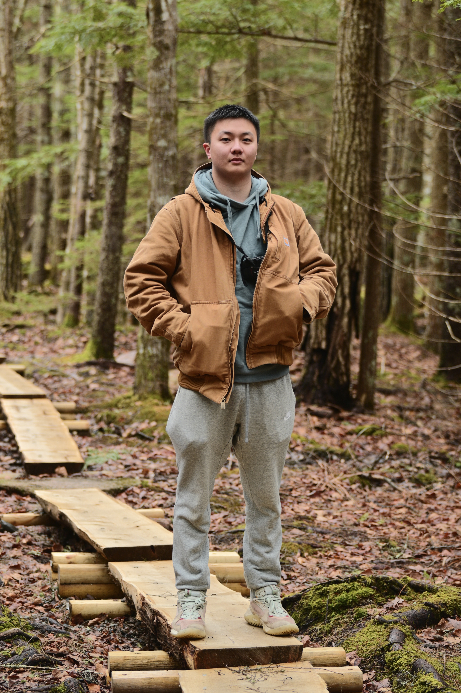

<!-- Header Start -->

    

        

            

                <h3 class="text-white font-weight-normal mb-3">Hello, my name</h3>
                <h1 class="display-3 text-uppercase text-primary mb-2" style="-webkit-text-stroke: 4px #ffffff;">Woody Lin</h1>
                <h1 class="typed-text-output d-inline font-weight-lighter text-white"></h1>
                
College Student, Computer Science, Game Developer, Web Designer, Photographer, 林万程

                

                    <a href="mailto:wancheng.lin001@gmail.com" class="btn btn-white mr-4">Email Me</a>                        
                    <a href="https://www.linkedin.com/in/woody-lin-32ab48161/" class="btn btn-blue d-none d-sm-block mr-2">LinkedIn</a>
                    <a href="https://github.com/WoodyLinwc" class="btn btn-blue d-none d-sm-block">GitHub</a>
                

            

            

                
            

        

    

<!-- Header End -->

<!-- About Start -->

    

        

            <h1 class="display-1 text-uppercase text-white" style="-webkit-text-stroke: 1px #dee2e6;font-size: 70px;">Portfolio</h1>
            <h1 class="position-absolute text-uppercase text-primary">About Me</h1>
        

        

            

                
            

            

                <h3 class="mb-4">A passionate computer science student</h3>
                

                    As a computer science student pursuing a bachelor's degree, 
                    I am eager to apply my knowledge and skills to real-world projects and challenges. 
                    My passion for technology and problem-solving drives me to stay up-to-date with the 
                    latest developments in the field, and I am always eager to learn more.
                

                

                    
<h6>Name: Woody Lin</h6>

                    <!-- 
<h6>Birthday: 1 April 1990</h6>
 -->
                    <!-- 
<h6>Education: Bachelor in Computer Science</h6>
 -->
                    
<h6>Location: Boston, MA</h6>

                    
<h6>Email: wancheng.lin001@gmail.com</h6>

                    
<h6>GPA: 3.72 Dean's List</h6>

                    
<h6>Education: 
                         ■ Bachelor degree in Computer Science, minor in Mathematics
                         ■ University of Massachusetts Boston, 2019 - 2023</h6>

                    
<h6>Relevant Coursework: 
                         ■ CS410 Software Engineering
                         ■ CS430 Database Management 
                         ■ CS450 The Structure of Higher Level Languages
                         ■ CS446 Introduction to Internetworking
                         ■ CS310 Data Structures and Algorithms
                         ■ CS420 An Introduction to the Theory of Computation
                         ■ CS444 Operating System
                    </h6>

                    
<h6>Technical Skills: 
                         ■ Object-oriented programming
                         ■ Data Structures and Algorithms
                         ■ GitHub Workflow
                         ■ Functional programming
                         ■ Scripting and Automation
                         ■ Data Management
                    </h6>

                    
<h6>Languages: Java, SQL, Python, JavaScript, C, Racket, HTML, CSS</h6>

                    <!-- 
<h6>Freelance: Available</h6>
 -->   
                

                <a href="https://woodylinwc.github.io/pdf/WoodyLinResume.pdf" target="_blank" class="btn btn-outline-primary nav-item">My Most Recent Resume</a>
                <!-- <a href="mailto:wancheng.lin001@gmail.com" class="btn blue btn-outline-primary mr-4">Contact Me</a> -->
                <a href="#project" class="btn btn-outline-primary nav-item">Learn More</a>
            

        

    

<!-- About End -->

<!-- Skill Start -->
<!-- 

    

        

            <h1 class="display-1 text-uppercase text-white" style="-webkit-text-stroke: 1px #dee2e6;">Skills</h1>
            <h1 class="position-absolute text-uppercase text-primary">My Skills</h1>
        

        

            

                

                    

                        <h6 class="font-weight-bold">HTML</h6>
                        <h6 class="font-weight-bold">95%</h6>
                    

                    

                        

                    

                

                

                    

                        <h6 class="font-weight-bold">CSS</h6>
                        <h6 class="font-weight-bold">85%</h6>
                    

                    

                        

                    

                

                

                    

                        <h6 class="font-weight-bold">PHP</h6>
                        <h6 class="font-weight-bold">90%</h6>
                    

                    

                        

                    

                

            

            

                

                    

                        <h6 class="font-weight-bold">Javascript</h6>
                        <h6 class="font-weight-bold">90%</h6>
                    

                    

                        

                    

                

                

                    

                        <h6 class="font-weight-bold">Angular JS</h6>
                        <h6 class="font-weight-bold">95%</h6>
                    

                    

                        

                    

                

                

                    

                        <h6 class="font-weight-bold">Wordpress</h6>
                        <h6 class="font-weight-bold">85%</h6>
                    

                    

                        

                    

                

            

        

    

 -->
<!-- Skill End -->

<!-- Qualification Start -->

    

        

            <h1 class="display-1 text-uppercase text-white" style="-webkit-text-stroke: 1px #dee2e6;font-size: 70px;">Quality</h1>
            <h1 class="position-absolute text-uppercase text-primary">My works</h1>
        

        

            

                <h3 class="mb-4">My Projects</h3>
                

                    

                        <i class="far fa-dot-circle text-primary position-absolute" style="top: 2px; left: -35px; font-size: 22px;"></i>
                        <h5 class="font-weight-bold mb-1">Full-Stack Kpop Review Platform</h5>
                        
<strong>Full-Stack Project</strong> | <small>Oct 2023 - Dec 2023</small>

                        

                            <a href="https://github.com/WoodyLinwc/kpop.rating.springboot" target="_blank">Spring Boot, ReactJS, MongoDB</a>
                             
                            ■ Crafted a song review application utilizing <b>Spring Boot</b> as the back end and <b>ReactJS</b> as the front end.
                             
                            ■ Utilized <b>Axios</b> to fetch K-pop songs and review data from the back-end API in Spring Boot.
                             
                            ■ Implemented a <b>RESTful API</b> with endpoints to facilitate <b>CRUD</b> operations on K-pop contents.
                             
                            ■ Leveraged <b>MongoTemplate</b> to perform more complex <b>MongoDB</b> interactions, such as updating associated K-pop content documents with review IDs when a new review is created.
                             
                            ■ Employed <b>Lombok</b> to generate boilerplate code, reducing verbosity in both ”Kpop” and ”Review” classes.
                             
                            ■ Applied dependency injection with <b>@Autowired</b> annotations, automatically injecting instances into the ”ReviewService” class when it’s initialized.
                             
                        

                    

                    

                        <i class="far fa-dot-circle text-primary position-absolute" style="top: 2px; left: -35px; font-size: 22px;"></i>
                        <h5 class="font-weight-bold mb-1">LE-V-EL</h5>
                        
<strong>CS410 Software Engineering</strong> | <small>Feb 2023 - May 2023</small>

                        

                            <a href="https://github.com/WoodyLinwc/LEVEL" target="_blank">LE-V-EL: Visualization Benchmarks for Machines</a>
                             
                            ■ Designed a dynamic website showcasing rankings of machine graphical perception algorithms on benchmark datasets using <b>HTML</b>, <b>CSS</b>, <b>JavaScript</b>, and <b>Jekyll</b>.
                             
                            ■ Managed <b>Python</b> files using <b>Miniconda</b> to ensure smooth execution and mitigate conflicts on the server side.
                             
                            ■ Leveraged <b>GitHub Workflow</b> to automate project processes directly within the GitHub repository.
                             
                            ■ Implemented a robust lock mechanism based on <b>YAML</b> configuration file on the school server; prevented the risk of infinite loops and streamlined workflow efficiency during GitHub Action execution.
                             
                            ■ Standardized the datasets and improved calculation speed by <b>40%</b> on the school’s server by employing <b>scikit-learn (sklearn)</b>, <b>numpy</b>, and <b>nltk</b> for efficient data preprocessing and analysis tasks.
                             
                        

                    

                    

                        <i class="far fa-dot-circle text-primary position-absolute" style="top: 2px; left: -35px;  font-size: 22px;"></i>
                        <h5 class="font-weight-bold mb-1">Twitter Bot</h5>
                        
<strong>Extracurricular</strong> | <small>May 2023 - Jun 2023</small>

                        

                            <a href="https://github.com/WoodyLinwc/Auto-Twitter-Bot" target="_blank">Automated Twitter Bot with Image Posting</a>
                             
                            ■ Developed a Twitter bot based on <b>AWS EC2</b> instance to select and upload pictures from a designated database once <b>every 6</b> hours (still operational remotely).
                             
                            ■ Implemented a time-based <b>CronJob</b> to acquire the necessary components by <b>Node.js</b>; integrated the <b>Twitter API</b> for automated tweeting, optimizing efficiency with <b>async/await</b> for handling asynchronous tasks.
                             
                            ■ Leveraged <b>PM2</b> for real-time monitoring management of the Twitter bot, ensuring consistent performance.
                             
                            ■ Published over <b>1,000</b> tweets to date and constantly gained followers.
                             
                        

                    

                    <!-- 

                        <i class="far fa-dot-circle text-primary position-absolute" style="top: 2px; left: -35px;  font-size: 22px;"></i>
                        <h5 class="font-weight-bold mb-1">2D Game Project</h5>
                        
<strong>Extracurricular</strong> | <small>May 2022 - Aug 2022</small>

                        

                            <a href="https://github.com/WoodyLinwc/Metro-Girl" target="_blank">2D Hack and Slash Game</a>
                             
                            ■ Designed and implemented game mechanics, UI, and graphics for a 2D game using <b>Gamemaker Studio 2</b>.
                             
                            ■ Created original game characters and assets, using tools such as <b>Procreate</b> and <b>Adobe Photoshop</b>.
                             
                            ■ Debugged and tested the game, ensuring a smooth and enjoyable gamer experience.
                             
                        

                    
 -->
                    <!-- 

                        <i class="far fa-dot-circle text-primary position-absolute" style="top: 2px; left: -35px;  font-size: 22px;"></i>
                        <h5 class="font-weight-bold mb-1">Infection and Vaccination Research</h5>
                        
<strong>Math345 Probability and Statics</strong> | <small>Nov 2021 - Dec 2021</small>

                        

                            <a href="https://docs.google.com/presentation/d/1QqUrtbTbH3y6LtyzGSO62aRg3ay6X3ybxS4nmf7yeMw/edit?usp=sharing" target="_blank">Final Project</a>
                             
                            ■ Conducted research on COVID-19 infection and vaccination rates, utilizing data analysis and visualization tools such as <b>R</b> and Excel.
                             
                            ■ Conducted statistical analyses, creating visualizations and graphs to help illustrate trends and patterns in the data.
                             
                            ■ Demonstrated strong communication, teamwork, and analytical skills, contributing to the project's success.
                             
                        

                    
 -->
                    <!-- 

                        <i class="far fa-dot-circle text-primary position-absolute" style="top: 2px; left: -35px;  font-size: 22px;"></i>
                        <h5 class="font-weight-bold mb-1">Web Game Project</h5>
                        
<strong>Extracurricular</strong> | <small>2021 - 2023</small>

                        

                            <a href="https://woodylinwc.github.io/game.html" target="_blank">Simple Web Games</a>
                             
                            ■ Developed web-based games using HTML, CSS, and JavaScript.
                             
                            ■ Wrote and optimized the game's code in JavaScript, ensuring efficient performance and scalability.
                             
                            ■ Deployed the game on a web server, using GitHub Pages to make them accessible online.
                                                  
                        

                    
 -->
                

            

            

                <h3 class="mb-4">My Experience</h3>
                

                    

                        <i class="far fa-dot-circle text-primary position-absolute" style="top: 2px;left: -35px;  font-size: 22px;"></i>
                        <h5 class="font-weight-bold mb-1">Teaching Assistant</h5>
                        
<strong>UMass Boston, CS Department</strong> | <small>Feb 2023 - Dec 2023</small>

                        

                            <a href="https://www.cs.umb.edu/~stchang/cs420/s23/info.html" target="_blank">CS420: Intro to Theory of Computation</a>
                             
                            <a href="https://woodylinwc.github.io/pdf/CS310_Syllabus.pdf" target="_blank">CS310: Advanced Data Structures and Algorithms</a>
                             
                            ■ Assisted professor in grading assignments and projects.
                             
                            ■ Held office hours to help students with course material and homework assignments.
                             
                            ■ Collaborated with fellow TAs to plan instructional activities.
                             
                            ■ Communicated with students on Piazza and via email.
                        

                    

                    

                        <i class="far fa-dot-circle text-primary position-absolute" style="top: 2px;left: -35px;  font-size: 22px;"></i>
                        <h5 class="font-weight-bold mb-1">Website Designer</h5>
                        
<strong>Part-time job</strong> | <small>Jul 2023 - Aug 2023</small>

                        

                            <a href="https://www.fe4f.com/" target="_blank">A Start-up Company: Financial Education for Families</a>
                             
                            ■ Collaborated with a designer to lead a successful website redesign project for a small finance company, amplifying their value proposition and strategic goals.
                             
                            ■ Leveraged user-centered design principles to optimize website navigation, resulting in enhanced user experience across various devices.
                             
                            ■ Managed project timelines, adapting to changing requirements and consistently exceeding milestones.
                             
                            ■ Integrated <b>Google Domains</b> to host the website.
                        

                    

                    

                        <i class="far fa-dot-circle text-primary position-absolute" style="top: 2px;left: -35px;  font-size: 22px;"></i>
                        <h5 class="font-weight-bold mb-1">CS Project Team Leader</h5>
                        
<strong>CS410 Software Engineering</strong> | <small>Feb 2023 - May 2023</small>

                        

                            <a href="https://github.com/WoodyLinwc/LEVEL" target="_blank">LE-V-EL: Visualization Benchmarks for Machines</a>
                             
                            ■ Coordinated project planning, task allocation, and progress tracking using Agile methodologies.
                             
                            ■ Facilitated communication among team members and with stakeholders to ensure project requirements were met.
                             
                            ■ Presented the project in front of clients and received an A at the end of the semester.
                             
                        

                    

                    

                        <i class="far fa-dot-circle text-primary position-absolute" style="top: 2px;left: -35px;  font-size: 22px;"></i>
                        <h5 class="font-weight-bold mb-1">Math Tutor</h5>
                        
<strong>Part-time job</strong> | <small>Jan 2021 - Present</small>

                        

                            ■ Provided individualized math tutoring services 4 hours a week to students of beginner level, focusing on areas of difficulty and tailoring instruction to meet specific needs.
                             
                            ■ Facilitated student progress, monitoring performance and adapting instruction to promote success and confidence.
                             
                            ■ Maintained regular communication with parents and students, providing progress updates and addressing concerns as needed.
                             
                        

                    

                

            

        

    

<!-- Qualification End -->

<!-- Services Start -->
<!-- 

    

        

            <h1 class="display-1 text-uppercase text-white" style="-webkit-text-stroke: 1px #dee2e6;">Service</h1>
            <h1 class="position-absolute text-uppercase text-primary">My Services</h1>
        

        

            

                

                    <i class="fa fa-2x fa-laptop service-icon bg-primary text-white mr-3"></i>
                    <h4 class="font-weight-bold m-0">Web Design</h4>
                

                
Justo sit justo eos amet tempor amet clita amet ipsum eos elitr. Amet lorem lorem lorem est amet labore eirmod erat clita

                <a class="border-bottom border-primary text-decoration-none" href="">Read More</a>
            

            

                

                    <i class="fa fa-2x fa-laptop-code service-icon bg-primary text-white mr-3"></i>
                    <h4 class="font-weight-bold m-0">Development</h4>
                

                
Justo sit justo eos amet tempor amet clita amet ipsum eos elitr. Amet lorem lorem

                <a class="border-bottom border-primary text-decoration-none" href="">Read More</a>
            

            

                

                    <i class="fab fa-2x fa-android service-icon bg-primary text-white mr-3"></i>
                    <h4 class="font-weight-bold m-0">Apps Design</h4>
                

                
Justo sit justo eos amet tempor amet clita amet ipsum eos elitr. Amet lorem lorem lorem est amet labore eirmod erat clita

                <a class="border-bottom border-primary text-decoration-none" href="">Read More</a>
            

            

                

                    <i class="fab fa-2x fa-apple service-icon bg-primary text-white mr-3"></i>
                    <h4 class="font-weight-bold m-0">Apps Development</h4>
                

                
Justo sit justo eos amet tempor amet clita amet ipsum eos elitr. Amet lorem lorem Amet lorem lorem

                <a class="border-bottom border-primary text-decoration-none" href="">Read More</a>
            

            

                

                    <i class="fa fa-2x fa-search service-icon bg-primary text-white mr-3"></i>
                    <h4 class="font-weight-bold m-0">SEO</h4>
                

                
Justo sit justo eos amet tempor amet clita amet ipsum eos elitr. Amet lorem  

                <a class="border-bottom border-primary text-decoration-none" href="">Read More</a>
            

            

                

                    <i class="fa fa-2x fa-edit service-icon bg-primary text-white mr-3"></i>
                    <h4 class="font-weight-bold m-0">Content Creating</h4>
                

                
Justo sit justo eos amet tempor amet clita amet ipsum eos elitr. Amet lorem lorem lorem est amet labore eirmod erat clita

                <a class="border-bottom border-primary text-decoration-none" href="">Read More</a>
            

        

    

 -->
<!-- Services End -->

<!-- Portfolio Start -->
<!-- 

    

        

            <h1 class="display-1 text-uppercase text-white" style="-webkit-text-stroke: 1px #dee2e6;">Gallery</h1>
            <h1 class="position-absolute text-uppercase text-primary">Photo Album</h1>
        

        

            

                <ul class="list-inline mb-4" id="portfolio-flters">
                    <li class="btn btn-sm btn-outline-primary m-1 active"  data-filter="*">All</li>
                    <li class="btn btn-sm btn-outline-primary m-1" data-filter=".first">Design</li>
                    <li class="btn btn-sm btn-outline-primary m-1" data-filter=".second">Development</li>
                    <li class="btn btn-sm btn-outline-primary m-1" data-filter=".third">Marketing</li>
                </ul>
            

        

        

            

                

                    
                    

                        <a href="img/portfolio-1.jpg" data-lightbox="portfolio">
                            <i class="fa fa-plus text-white" style="font-size: 60px;"></i>
                        </a>
                    

                

            

            

                

                    
                    

                        <a href="img/portfolio-2.jpg" data-lightbox="portfolio">
                            <i class="fa fa-plus text-white" style="font-size: 60px;"></i>
                        </a>
                    

                

            

            

                

                    
                    

                        <a href="img/portfolio-3.jpg" data-lightbox="portfolio">
                            <i class="fa fa-plus text-white" style="font-size: 60px;"></i>
                        </a>
                    

                

            

            

                

                    
                    

                        <a href="img/portfolio-4.jpg" data-lightbox="portfolio">
                            <i class="fa fa-plus text-white" style="font-size: 60px;"></i>
                        </a>
                    

                

            

            

                

                    
                    

                        <a href="img/portfolio-5.jpg" data-lightbox="portfolio">
                            <i class="fa fa-plus text-white" style="font-size: 60px;"></i>
                        </a>
                    

                

            

            

                

                    
                    

                        <a href="img/portfolio-6.jpg" data-lightbox="portfolio">
                            <i class="fa fa-plus text-white" style="font-size: 60px;"></i>
                        </a>
                    

                

            

        

    

 -->
<!-- Portfolio End -->

<!-- Location Start-->

    

        

            <h1 class="display-1 text-uppercase text-white" style="-webkit-text-stroke: 1px #dee2e6;font-size: 70px;">Location</h1>
            <h1 class="position-absolute text-uppercase text-primary">Work Area</h1>
        

        

            <iframe src="https://www.google.com/maps/embed?pb=!1m14!1m12!1m3!1d32007.09388043201!2d-71.05258038933074!3d42.33842665666138!2m3!1f0!2f0!3f0!3m2!1i1024!2i768!4f13.1!5e0!3m2!1sen!2sus!4v1677377310859!5m2!1sen!2sus" frameborder="0" style="border:0; width: 80%; height: 550px;" allowfullscreen></iframe>            
        

    

<!-- Location End-->

