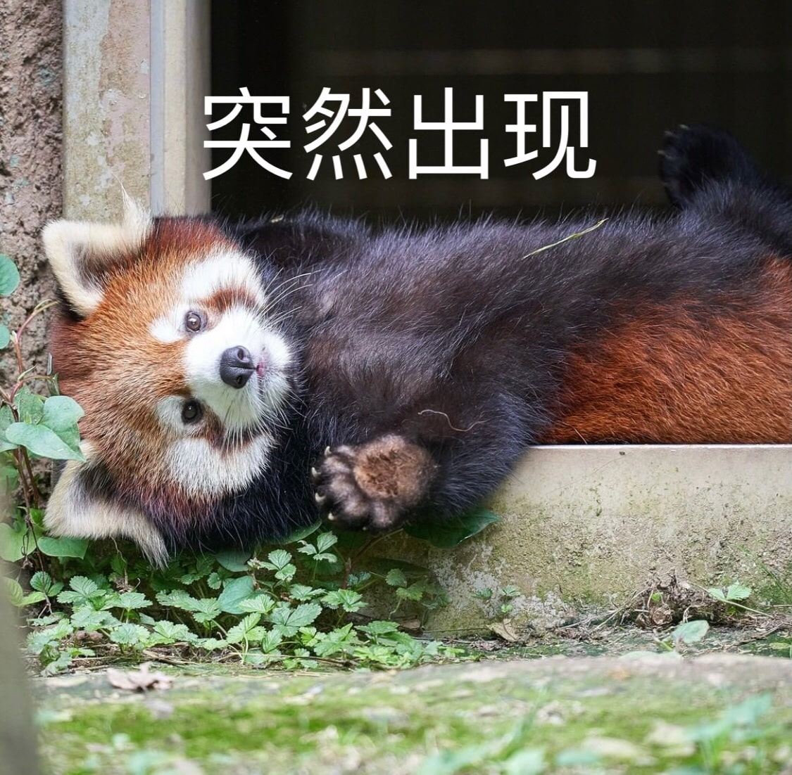

<!-- Header Start -->

<!-- Header End -->

<!-- Testimonial Start -->

    

        

            <h1 class="display-1 text-uppercase text-white" style="-webkit-text-stroke: 1px #dee2e6;">今晚又吃点啥呢</h1>
            <h1 class="position-absolute text-uppercase text-primary">今天胡思乱想些啥呢</h1>
    

<!-- Testimonial End -->

<!-- Twitter Start-->

<button id="generate-button" onclick="generateRandomTweet()" class="btn btn-outline-primary nav-item">看看下一个</button>

 
<!-- Twitter End-->

<!-- Redpanda Start-->

    

        

            <h1 class="position-absolute text-uppercase text-primary">不如看点小熊猫</h1>
        

    

 
<button id="generate-button" onclick="generateRandomImage()" class="btn btn-outline-primary nav-item">点击图片来看更多！</button>

<!-- Redpanda End-->

