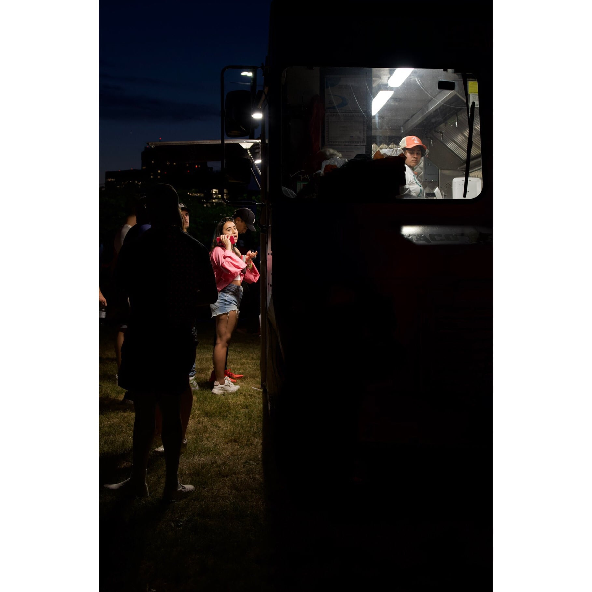
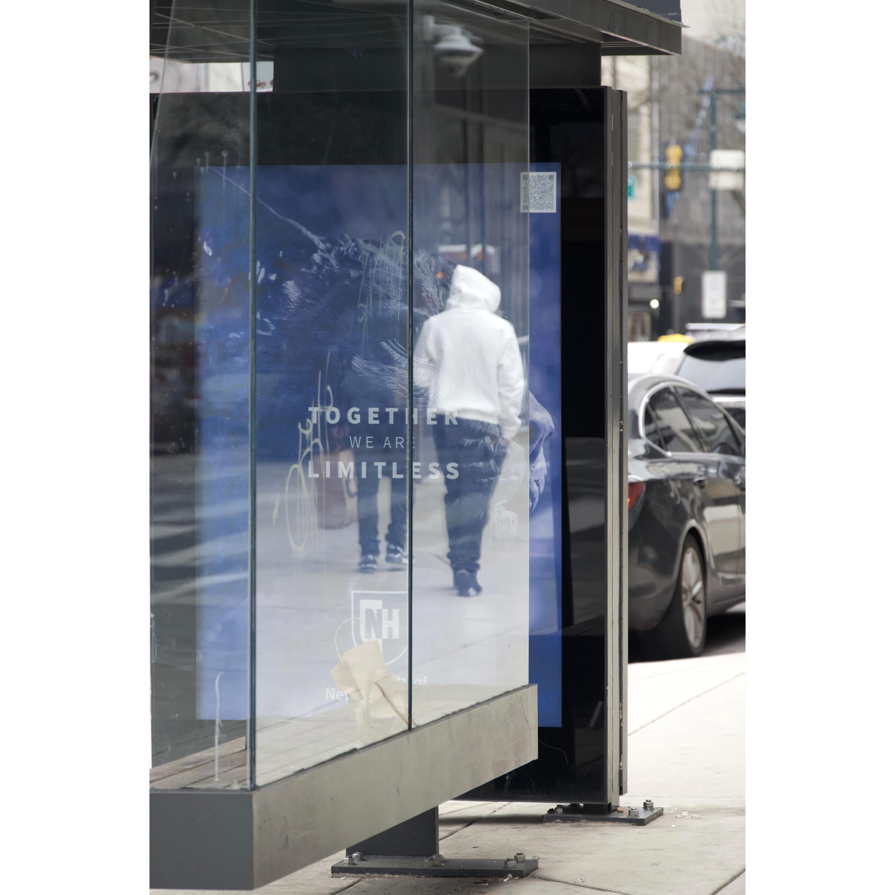
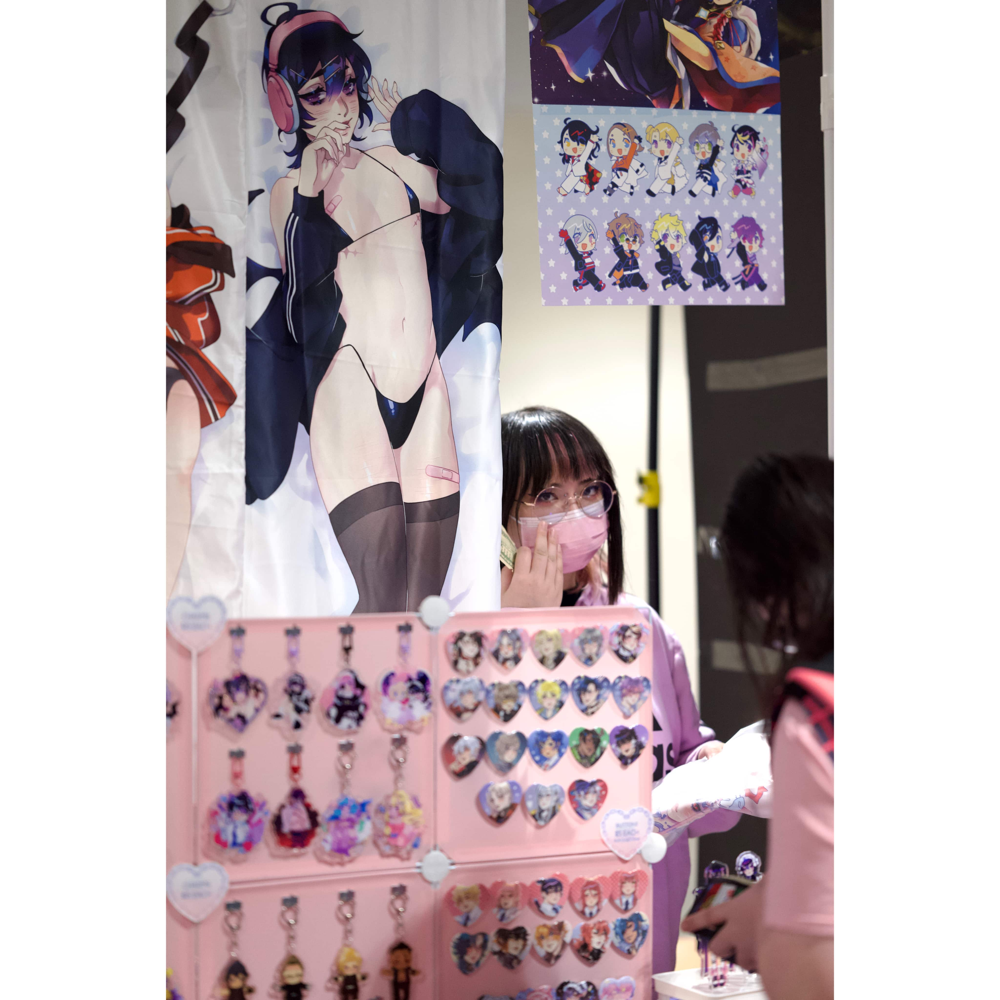
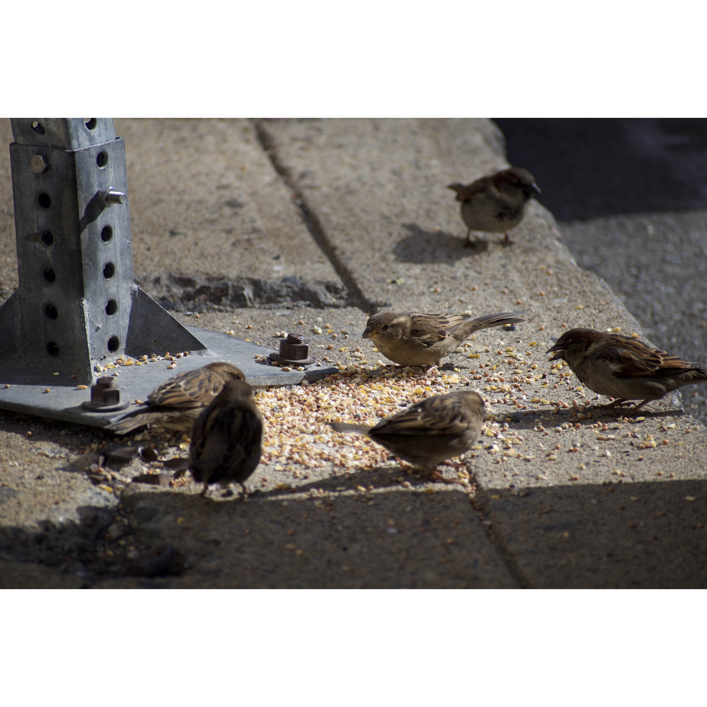
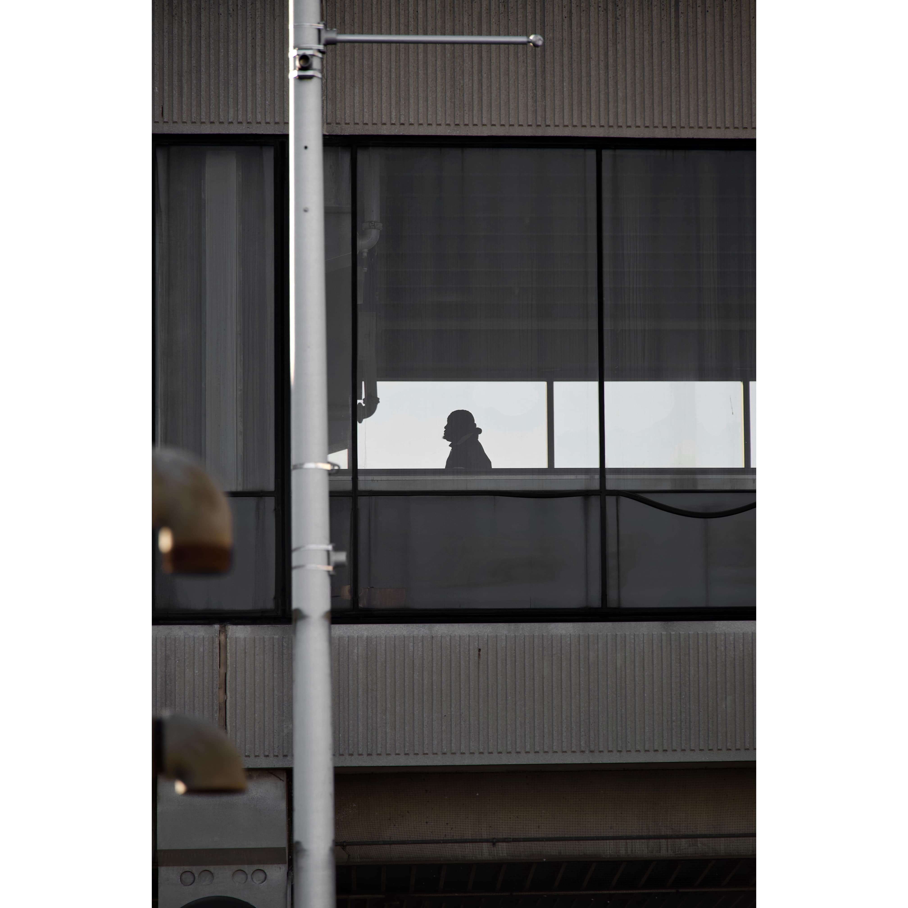
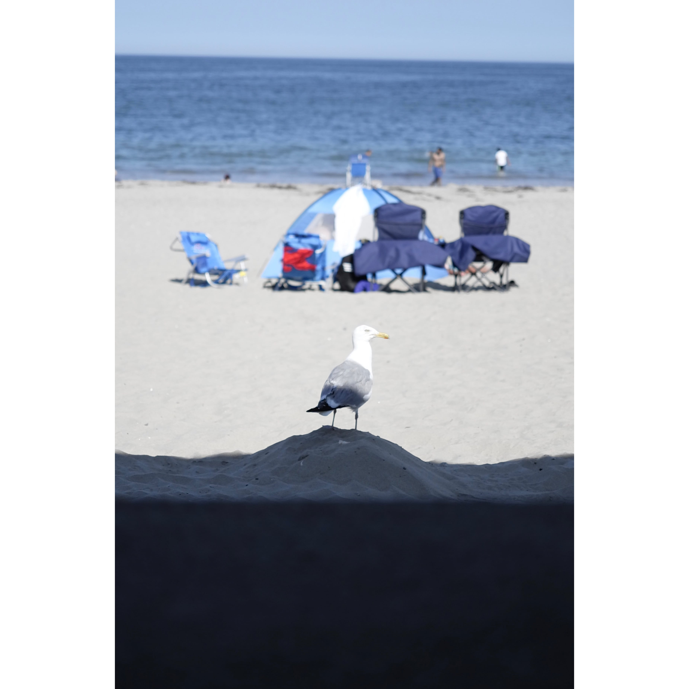
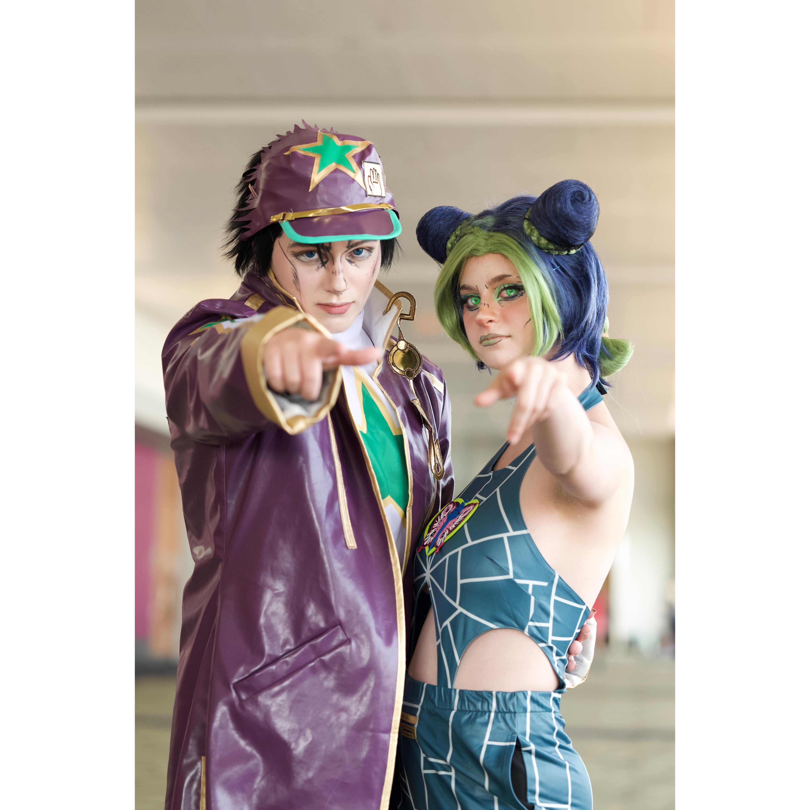
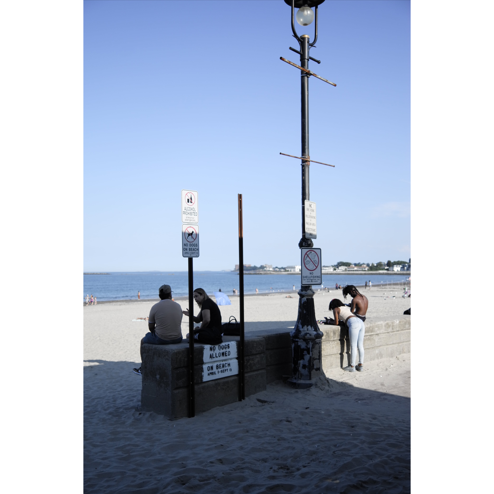
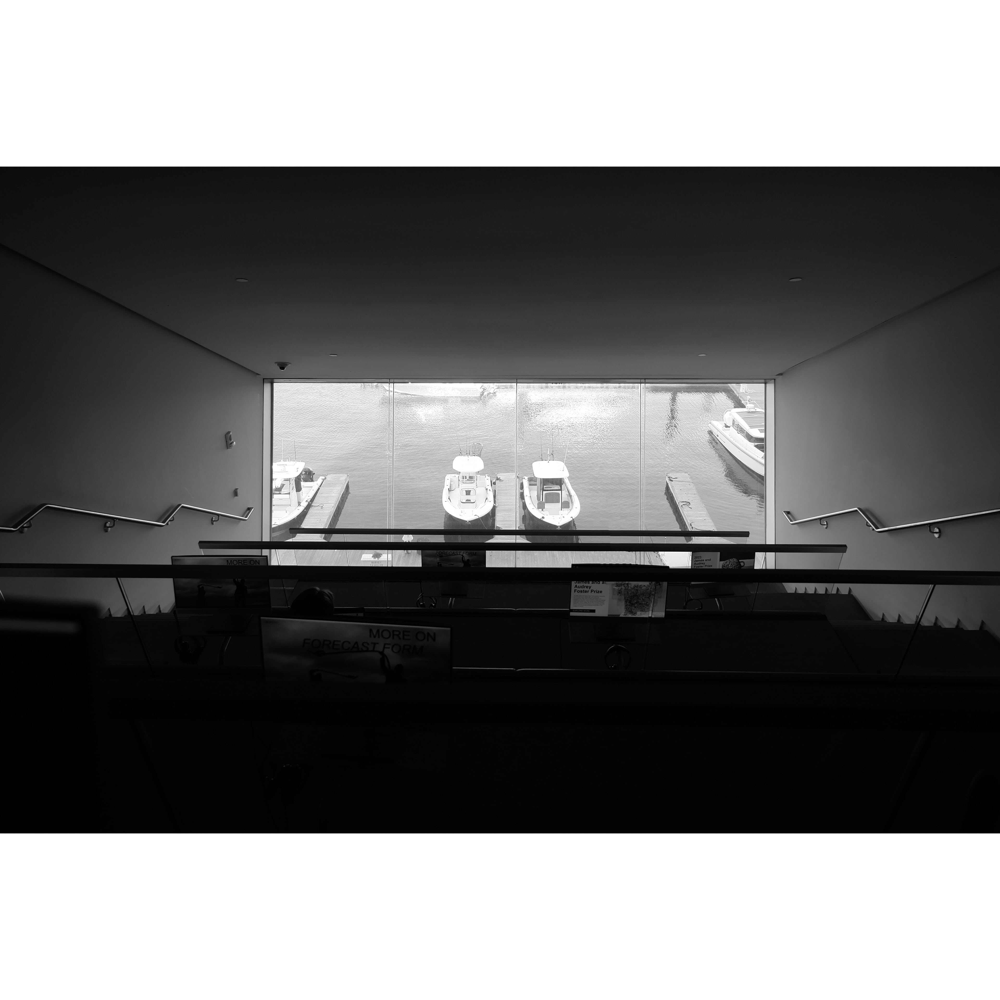

<!-- Header Start -->

<!-- Header End -->

<!-- Portfolio Start -->

    

        

            <h1 class="display-1 text-uppercase text-white" style="-webkit-text-stroke: 1px #dee2e6;font-size: 100px;">Gallery</h1>
            <h1 class="position-absolute text-uppercase text-primary">Photo Album</h1>
        

        

            

                <ul class="list-inline mb-4" id="portfolio-flters">
                    <li class="btn btn-sm btn-outline-primary m-1 active"  data-filter="*">All</li>
                    <li class="btn btn-sm btn-outline-primary m-1" data-filter=".first">Night</li>
                    <li class="btn btn-sm btn-outline-primary m-1" data-filter=".second">Travel</li>
                    <li class="btn btn-sm btn-outline-primary m-1" data-filter=".third">Street</li>
                    <li class="btn btn-sm btn-outline-primary m-1" data-filter=".fourth">Animal</li>
                    <li class="btn btn-sm btn-outline-primary m-1" data-filter=".fifth">Event</li>
                </ul>
            

        

        

            

                

                    
                    

                        <a href="img/album/shadow-min.JPG" data-lightbox="portfolio">
                            <i class="fa fa-plus text-white" style="font-size: 60px;"></i>
                        </a>
                    

                

            

            

                

                    
                    

                        <a href="img/album/comparision-min.jpg" data-lightbox="portfolio">
                            <i class="fa fa-plus text-white" style="font-size: 60px;"></i>
                        </a>
                    

                

            

            

                

                    
                    

                        <a href="img/album/taxi-min.JPG" data-lightbox="portfolio">
                            <i class="fa fa-plus text-white" style="font-size: 60px;"></i>
                        </a>
                    

                

            

            

                

                    
                    

                        <a href="img/album/mirror-min.JPG" data-lightbox="portfolio">
                            <i class="fa fa-plus text-white" style="font-size: 60px;"></i>
                        </a>
                    

                

            

            

                

                    
                    

                        <a href="img/album/bike-min.JPG" data-lightbox="portfolio">
                            <i class="fa fa-plus text-white" style="font-size: 60px;"></i>
                        </a>
                    

                

            

            

                

                    
                    

                        <a href="img/album/three-min.JPG" data-lightbox="portfolio">
                            <i class="fa fa-plus text-white" style="font-size: 60px;"></i>
                        </a>
                    

                

            

            

                

                    
                    

                        <a href="img/album/train-min.JPG" data-lightbox="portfolio">
                            <i class="fa fa-plus text-white" style="font-size: 60px;"></i>
                        </a>
                    

                

            

            

                

                    
                    

                        <a href="img/album/starring-min.JPG" data-lightbox="portfolio">
                            <i class="fa fa-plus text-white" style="font-size: 60px;"></i>
                        </a>
                    

                

            

            

                

                    
                    

                        <a href="img/album/handsome-min.JPG" data-lightbox="portfolio">
                            <i class="fa fa-plus text-white" style="font-size: 60px;"></i>
                        </a>
                    

                

            

            

                

                    
                    

                        <a href="img/album/summervibe-min.JPG" data-lightbox="portfolio">
                            <i class="fa fa-plus text-white" style="font-size: 60px;"></i>
                        </a>
                    

                

            

            

                

                    
                    

                        <a href="img/album/god-min.JPG" data-lightbox="portfolio">
                            <i class="fa fa-plus text-white" style="font-size: 60px;"></i>
                        </a>
                    

                

            

            

                

                    
                    

                        <a href="img/album/descending-min.JPG" data-lightbox="portfolio">
                            <i class="fa fa-plus text-white" style="font-size: 60px;"></i>
                        </a>
                    

                

            

            

                

                    
                    

                        <a href="img/album/hog-min.JPG" data-lightbox="portfolio">
                            <i class="fa fa-plus text-white" style="font-size: 60px;"></i>
                        </a>
                    

                

            

            

                

                    
                    

                        <a href="img/album/dual-min.JPG" data-lightbox="portfolio">
                            <i class="fa fa-plus text-white" style="font-size: 60px;"></i>
                        </a>
                    

                

            

            

                

                    
                    

                        <a href="img/album/fatherlove-min.JPG" data-lightbox="portfolio">
                            <i class="fa fa-plus text-white" style="font-size: 60px;"></i>
                        </a>
                    

                

            

            

                

                    
                    

                        <a href="img/album/selling-min.JPG" data-lightbox="portfolio">
                            <i class="fa fa-plus text-white" style="font-size: 60px;"></i>
                        </a>
                    

                

            

            

                

                    
                    

                        <a href="img/album/sparow-min.jpg" data-lightbox="portfolio">
                            <i class="fa fa-plus text-white" style="font-size: 60px;"></i>
                        </a>
                    

                

            

            

                

                    
                    

                        <a href="img/album/handsup-min.JPG" data-lightbox="portfolio">
                            <i class="fa fa-plus text-white" style="font-size: 60px;"></i>
                        </a>
                    

                

            

            

                

                    
                    

                        <a href="img/album/kiss1-min.JPG" data-lightbox="portfolio">
                            <i class="fa fa-plus text-white" style="font-size: 60px;"></i>
                        </a>
                    

                

            

            

                

                    
                    

                        <a href="img/album/kiss2-min.JPG" data-lightbox="portfolio">
                            <i class="fa fa-plus text-white" style="font-size: 60px;"></i>
                        </a>
                    

                

            

            

                

                    
                    

                        <a href="img/album/lightwave-min.JPG" data-lightbox="portfolio">
                            <i class="fa fa-plus text-white" style="font-size: 60px;"></i>
                        </a>
                    

                

            

            

                

                    
                    

                        <a href="img/album/maid-min.JPG" data-lightbox="portfolio">
                            <i class="fa fa-plus text-white" style="font-size: 60px;"></i>
                        </a>
                    

                

            

            

                

                    
                    

                        <a href="img/album/piano-min.JPG" data-lightbox="portfolio">
                            <i class="fa fa-plus text-white" style="font-size: 60px;"></i>
                        </a>
                    

                

            

            

                

                    
                    

                        <a href="img/album/shine-min.JPG" data-lightbox="portfolio">
                            <i class="fa fa-plus text-white" style="font-size: 60px;"></i>
                        </a>
                    

                

            

            

                

                    
                    

                        <a href="img/album/window-min.JPG" data-lightbox="portfolio">
                            <i class="fa fa-plus text-white" style="font-size: 60px;"></i>
                        </a>
                    

                

            

            

                

                    
                    

                        <a href="img/album/walking-min.JPG" data-lightbox="portfolio">
                            <i class="fa fa-plus text-white" style="font-size: 60px;"></i>
                        </a>
                    

                

            

            

                

                    
                    

                        <a href="img/album/sunset-min.JPG" data-lightbox="portfolio">
                            <i class="fa fa-plus text-white" style="font-size: 60px;"></i>
                        </a>
                    

                

            

            

                

                    
                    

                        <a href="img/album/cannon-min.JPG" data-lightbox="portfolio">
                            <i class="fa fa-plus text-white" style="font-size: 60px;"></i>
                        </a>
                    

                

            

            

                

                    
                    

                        <a href="img/album/crane-min.JPG" data-lightbox="portfolio">
                            <i class="fa fa-plus text-white" style="font-size: 60px;"></i>
                        </a>
                    

                

            

            

                

                    
                    

                        <a href="img/album/capture-min.JPG" data-lightbox="portfolio">
                            <i class="fa fa-plus text-white" style="font-size: 60px;"></i>
                        </a>
                    

                

            

            

                

                    
                    

                        <a href="img/album/wheel-min.JPG" data-lightbox="portfolio">
                            <i class="fa fa-plus text-white" style="font-size: 60px;"></i>
                        </a>
                    

                

            

            

                

                    
                    

                        <a href="img/album/luggage-min.JPG" data-lightbox="portfolio">
                            <i class="fa fa-plus text-white" style="font-size: 60px;"></i>
                        </a>
                    

                

            

            

                

                    
                    

                        <a href="img/album/fishing-min.PNG" data-lightbox="portfolio">
                            <i class="fa fa-plus text-white" style="font-size: 60px;"></i>
                        </a>
                    

                

            

            

                

                    
                    

                        <a href="img/album/bluegirl-min.JPG" data-lightbox="portfolio">
                            <i class="fa fa-plus text-white" style="font-size: 60px;"></i>
                        </a>
                    

                

            

            

                

                    
                    

                        <a href="img/album/toy-min.JPG" data-lightbox="portfolio">
                            <i class="fa fa-plus text-white" style="font-size: 60px;"></i>
                        </a>
                    

                

            

            

                

                    
                    

                        <a href="img/album/watching-min.JPG" data-lightbox="portfolio">
                            <i class="fa fa-plus text-white" style="font-size: 60px;"></i>
                        </a>
                    

                

            

            

                

                    
                    

                        <a href="img/album/shadowcloud-min.JPG" data-lightbox="portfolio">
                            <i class="fa fa-plus text-white" style="font-size: 60px;"></i>
                        </a>
                    

                

            

            

                

                    
                    

                        <a href="img/album/seagull-min.JPG" data-lightbox="portfolio">
                            <i class="fa fa-plus text-white" style="font-size: 60px;"></i>
                        </a>
                    

                

            

            

                

                    
                    

                        <a href="img/album/blackrest-min.JPG" data-lightbox="portfolio">
                            <i class="fa fa-plus text-white" style="font-size: 60px;"></i>
                        </a>
                    

                

            

            

                

                    
                    

                        <a href="img/album/tatoogirl-min.JPG" data-lightbox="portfolio">
                            <i class="fa fa-plus text-white" style="font-size: 60px;"></i>
                        </a>
                    

                

            

            

                

                    
                    

                        <a href="img/album/jojo-min.JPG" data-lightbox="portfolio">
                            <i class="fa fa-plus text-white" style="font-size: 60px;"></i>
                        </a>
                    

                

            

            

                

                    
                    

                        <a href="img/album/kiss-min.JPG" data-lightbox="portfolio">
                            <i class="fa fa-plus text-white" style="font-size: 60px;"></i>
                        </a>
                    

                

            

            <!-- 11/11/2023 -->
            

                

                    
                    

                        <a href="img/album/makeup-min.JPG" data-lightbox="portfolio">
                            <i class="fa fa-plus text-white" style="font-size: 60px;"></i>
                        </a>
                    

                

            

            

                

                    
                    

                        <a href="img/album/beachkissing-min.JPG" data-lightbox="portfolio">
                            <i class="fa fa-plus text-white" style="font-size: 60px;"></i>
                        </a>
                    

                

            

            

                

                    
                    

                        <a href="img/album/beachlight-min.JPG" data-lightbox="portfolio">
                            <i class="fa fa-plus text-white" style="font-size: 60px;"></i>
                        </a>
                    

                

            

            

                

                    
                    

                        <a href="img/album/lonelywalking-min.JPG" data-lightbox="portfolio">
                            <i class="fa fa-plus text-white" style="font-size: 60px;"></i>
                        </a>
                    

                

            

            

                

                    
                    

                        <a href="img/album/lonelycrane-min.JPG" data-lightbox="portfolio">
                            <i class="fa fa-plus text-white" style="font-size: 60px;"></i>
                        </a>
                    

                

            

            

                

                    
                    

                        <a href="img/album/captain-min.JPG" data-lightbox="portfolio">
                            <i class="fa fa-plus text-white" style="font-size: 60px;"></i>
                        </a>
                    

                

            

            

                

                    
                    

                        <a href="img/album/distantcity-min.JPG" data-lightbox="portfolio">
                            <i class="fa fa-plus text-white" style="font-size: 60px;"></i>
                        </a>
                    

                

            

            

                

                    
                    

                        <a href="img/album/viewing-min.JPG" data-lightbox="portfolio">
                            <i class="fa fa-plus text-white" style="font-size: 60px;"></i>
                        </a>
                    

                

            

            

                

                    
                    

                        <a href="img/album/darklight-min.JPG" data-lightbox="portfolio">
                            <i class="fa fa-plus text-white" style="font-size: 60px;"></i>
                        </a>
                    

                

            

            

                

                    
                    

                        <a href="img/album/doubleshadow-min.JPG" data-lightbox="portfolio">
                            <i class="fa fa-plus text-white" style="font-size: 60px;"></i>
                        </a>
                    

                

            

            

                

                    
                    

                        <a href="img/album/icawindow-min.JPG" data-lightbox="portfolio">
                            <i class="fa fa-plus text-white" style="font-size: 60px;"></i>
                        </a>
                    

                

            

            

                

                    
                    

                        <a href="img/album/icalight-min.JPG" data-lightbox="portfolio">
                            <i class="fa fa-plus text-white" style="font-size: 60px;"></i>
                        </a>
                    

                

            

            <!-- More Photos -->
        

    

<!-- Portfolio End -->

<!-- Portfolio Start -->
<!-- 

    

        

            <h1 class="display-1 text-uppercase text-white" style="-webkit-text-stroke: 1px #dee2e6;">Gallery</h1>
            <h1 class="position-absolute text-uppercase text-primary">Drawing Album</h1>
        

        

            

                <ul class="list-inline mb-4" id="portfolio-flters">
                    <li class="btn btn-sm btn-outline-primary m-1 active"  data-filter="*">All</li>
                    <li class="btn btn-sm btn-outline-primary m-1" data-filter=".first">Design</li>
                    <li class="btn btn-sm btn-outline-primary m-1" data-filter=".second">Development</li>
                    <li class="btn btn-sm btn-outline-primary m-1" data-filter=".third">Marketing</li>
                </ul>
            

        

        

            

                

                    
                    

                        <a href="img/portfolio-1.jpg" data-lightbox="portfolio">
                            <i class="fa fa-plus text-white" style="font-size: 60px;"></i>
                        </a>
                    

                

            

            
        

    

 -->
<!-- Portfolio End -->

<!-- Chat Start -->

    

    
    <noscript>Please enable JavaScript to view the <a href="https://disqus.com/?ref_noscript">comments powered by Disqus.</a></noscript>

<!-- Chat End -->

    